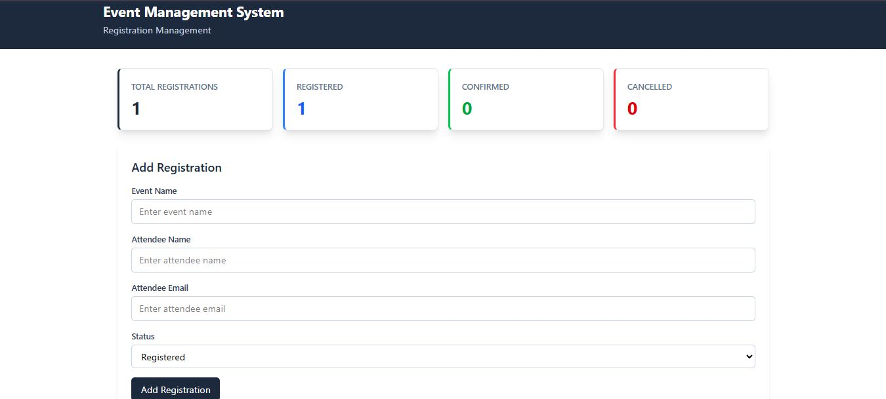
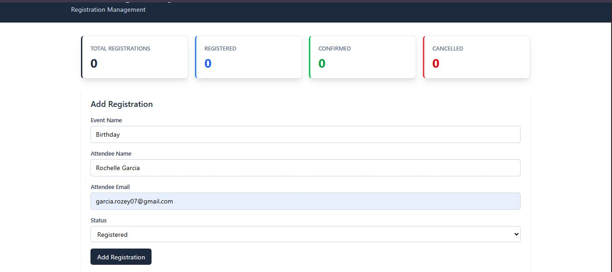
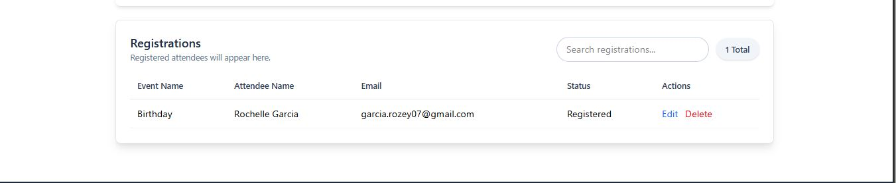
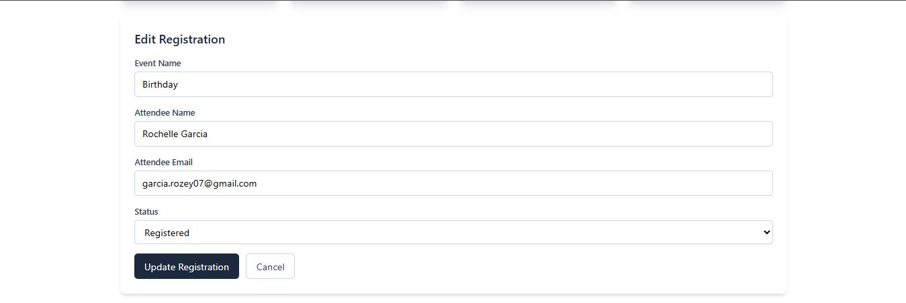

# Event Management System — Registration Management
Name: Rose Tita Rochelle T. Garcia
Course and Section: BSCS 3A
Subject: Software Engineering 1
Module: Module 7 - DESIGN AND IMPLEMENTATION
Instructor: Patrick Jason L. Torres

## Project Description

The Event Management System is a web-based registration management application developed using Vue 3. It allows users to manage event registration records through a simple and responsive interface. The system provides functions for adding, viewing, searching, editing, updating, and deleting registration records.

The system is based on the Event Management System designed in Module 6. The selected entity carried over from Module 6 is the Registration entity, which contains information such as event name, attendee name, attendee email, and registration status.

## Implemented Features

* Add new event registration records
* Display registration records in a table
* Search registration records
* Edit existing registration records
* Update registration information
* Cancel editing and return to Add mode
* Delete registration records with confirmation
* Display registration statistics:

  * Total Registrations
  * Registered
  * Confirmed
  * Cancelled
* Form validation for required information
* Success messages for adding and updating records
* Persistent data storage using browser localStorage
* Responsive user interface using Tailwind CSS

## Technologies Used

* Vue 3 — Frontend framework
* Vite — Development and build tool
* JavaScript — Application logic
* Tailwind CSS — User interface styling
* HTML — Application structure
* CSS — Additional styling
* localStorage — Client-side data persistence
* Git and GitHub — Version control

## Installation and Run Instructions

1. Clone or download the project - Open the project folder in Visual Studio Code.

2. Install dependencies - Open the terminal inside the project folder and run:
```bash
npm install
```

3. Start the development server

Run:
```bash
npm run dev
```
4. Open the application
Open the localhost URL provided by Vite in the browser, for example:
```text
http://localhost:5173
```
## Build Verification

The project includes a GitHub Actions workflow that automatically checks the Vue application whenever changes are pushed to the `main` branch. The workflow installs the project dependencies using `npm ci` and verifies that the application builds successfully using `npm run build`. A successful build is displayed with a green check mark in the GitHub Actions tab.

## localStorage Implementation

The application uses the browser's localStorage to store registration records. This allows the records to remain available even after refreshing or reopening the browser page.

The system uses the following localStorage key:

```text
module7-records
```

Whenever a registration is added, updated, or deleted, the records are saved to localStorage. When the application starts, the stored records are loaded back into the system.

## Connection Between Module 6 and Module 7

Module 7 continues the Event Management System designed in Module 6. In Module 6, the system architecture was planned using a three-tier client-server architecture consisting of the Presentation Layer, Application Layer, and Data Layer.

The Module 6 system proposed the following technology structure:

* Presentation Layer: Vue.js
* Application Layer: Node.js and Express
* Data Layer: MongoDB Atlas
* Main Entity: Registration

For Module 7, the Vue.js frontend implementation was developed based on the Registration entity from Module 6. The registration fields from the proposed database design were carried into the Vue application:

* `id`
* `eventName`
* `attendeeName`
* `attendeeEmail`
* `status`

Instead of connecting to the backend and MongoDB at this stage, Module 7 uses **localStorage** to simulate persistent data storage while focusing on the frontend system implementation and functionality.

## Application Screenshots

### Event Management System Dashboard



### Add Registration Form



### Registration List



### Edit Registration



## Limitations and Future Improvements

The current system uses browser localStorage for data storage, so registration records are limited to the current browser environment and are not yet connected to the Node.js, Express, and MongoDB Atlas backend planned in Module 6. The system also does not currently include user authentication, authorization, advanced reporting, or deployment to a production environment. In the future, the system can be improved by connecting the Vue.js frontend to the Node.js and Express backend and MongoDB Atlas database, adding authentication and administrator features, providing registration reports and data export, and deploying the application for actual use.

