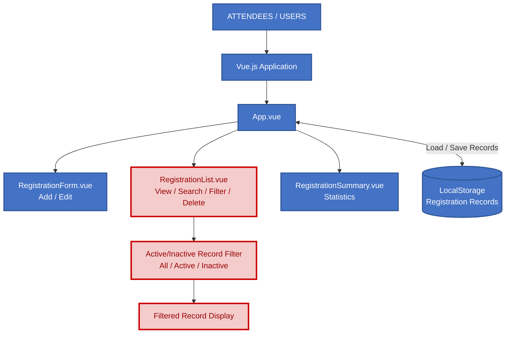

# Updated Architecture – Module 9

## Architecture Update Annotation

Module 9 adds an **Active/Inactive Record Filter** to the `RegistrationList.vue` component. The existing Vue.js component structure and localStorage-based record persistence remain unchanged. The update only affects the record filtering and display flow.
